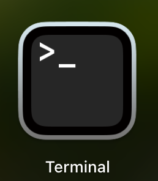
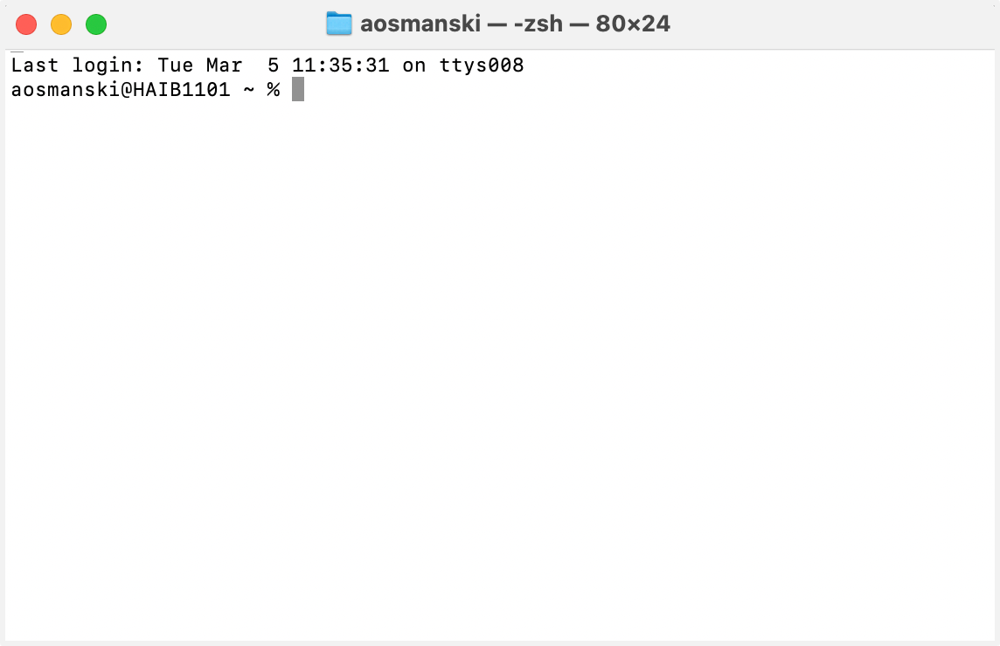

Before we can dive into our chloroplast assembly, we first need to pick up a few terminal basics
=========================================

Let's learn a few commands to help us navigate around inside the terminal:
This website has a brief tutorial covering useful commabnds like: ``ls``, ``head``, ``tail``, and ``grep``:
https://sandbox.bio/tutorials/terminal-basics

A few more commands we’ll need to know: 

``cd`` this is short for *change directories*. This is how you move around in the terminal.

``pwd`` this is short for *print working directory*. This is how you find out your current location in the directory structure

``cat`` this is short for *concatenate*, which simply means "to link together"

Let's get started using your computer's terminal
^^^^^^^^^^^^^^^^^^^^^^^^^^^^^^^^^

Open your terminal window from the taskbar (or by going to Applications > Utilities > Terminal)

    

You should see a window pop up that looks like this:

    

Click inside the terminal and enter the following commands:

.. code-block:: bash

    cd Desktop/Genome_Cookbook

    ls
