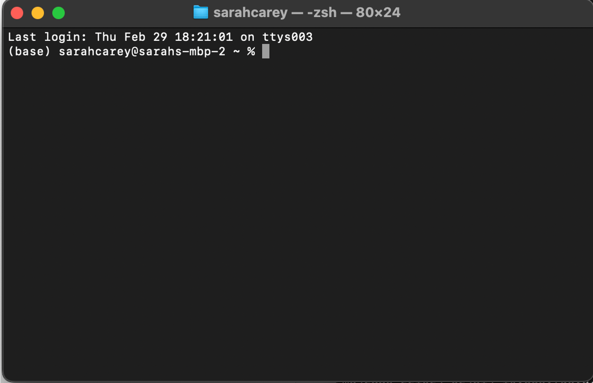

Before we can dive into our chloroplast assembly, we first need to pick up a few terminal basics
=========================================

Let's learn a few commands to help us navigate around inside the terminal:
This website has a brief tutorial covering useful commabnds like: ``ls``, ``head``, ``tail``, and ``grep``:
https://sandbox.bio/tutorials/terminal-basics

A few more commands we’ll need to know: 

``cd`` this is short for *change directories*. This is how you move around in the terminal.

``pwd`` this is short for *print working directory*. This is how you find out your current location in the directory structure

``cat`` this is short for *concatenate*, which simply means "to link together"

Let's get started using your computer's terminal
^^^^^^^^^^^^^^^^^^^^^^^^^^^^^^^^^

Open your terminal window from the taskbar (or by going to Applications > Utilities > Terminal)
"""""""""""""""""""""""""""""

|
|

You should see a window pop up that looks like this:
""""""""""""""""""""""""""""""

|

Let's run some commands!
""""""""""""""""""""""""

Go into the "Genome_Cookbook" directory and see what files and directories are saved inside:

.. code-block:: bash

    cd Desktop/Genome_Cookbook
|

Use the ``pwd`` command to view the full path to the Genome_Cookbook

|

Now use the ``ls`` command to view all the files within this directory. 

|

What do you see? 

|

Let's try the ``cat`` function. The code below takes all of the contents in **file1.txt** and attaches all of the contents of **file2.txt** to the end of it. The ``>`` symbol is used to *save* the output from the ``cat`` function to a new file called **files_combined.txt**

.. code-block:: bash

    cat file1.txt file2.txt > files_combined.txt
|
What command did we learn that can be used to view the output of files_combined.txt?

*Hint, the results will be at the top of the file*

