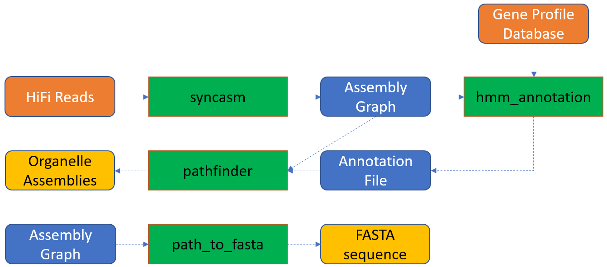

Chloroplast Assembly Generation
===============================

Oatk: an organelle genome assembly toolkit
------------------------------------------

    Image source: https://github.com/c-zhou/oatk

Now that we have some terminal basics
^^^^^^^^^^^^^^^^^^^^^^
we can begin assembling our chloroplast!
^^^^^^^^^^^^^^^^^^^^^^^

First, let’s export the path where the programs we need to use are installed:

.. code-block:: bash

    cd into Desktop/Genome_Cookbook/programs/

Next, retrieve your current path:

.. code-block:: bash

    pwd

Now, copy the path and paste it into the line of code below:

.. code-block:: bash

    export PATH_PROGRAMS=<insert your copied path here>

*For example:*

.. code-block:: bash

    export PATH_PROGRAMS=/Users/sylvesterthecat/Desktop/Genome_Cookbook/programs

Copy this entire line into your terminal window and hit enter

We just created a shortcut for ourselves so we don't have to type the entire path every single time we want to run a program. Now all we have to do is call ``PATH_PROGRAMS``

To verify that you've completed this step correctly, run ``pwd`` followed by ``echo`` to see if the output is the same.

.. code-block:: bash
    pwd
    echo $PATH_PROGRAMS

Now we’re ready to run our programs!
^^^^^^^^^^^^^^^^^^^^^^^^^^^^^^^^^^^

Assemble the chloroplast genome using Oatk
""""""""""""""""""""""""""""""""""""""""""

.. code-block:: bash

    $PATH_PROGRAMS/oatk-1.0/oatk -k 1001 -c 150 -t 1 --nhmmscan $PATH_PROGRAMS/hmmer-3.4/src/nhmmscan -p $PATH_PROGRAMS/oatk-1.0/embryophyta_pltd.fam -o red_mulberry_chloroplast m64233e_221024_024514_5x.ccs.fastq.gz

Let’s take a look at some of the output:

.. code-block:: bash
    head red_mulberry_chloroplast.pltd.ctg.fasta

You should see a line that starts with a ``>`` This is the header, basically it’s a descriptive line for the sequence in the file. Below you should see a string of As, Ts, Cs, and Gs. Those are part of your chloroplast assembly! 

