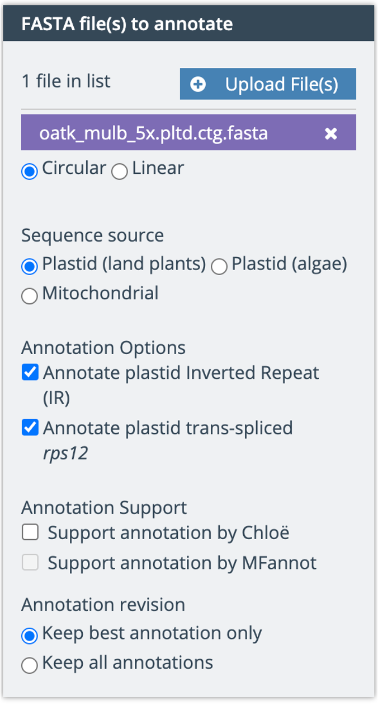
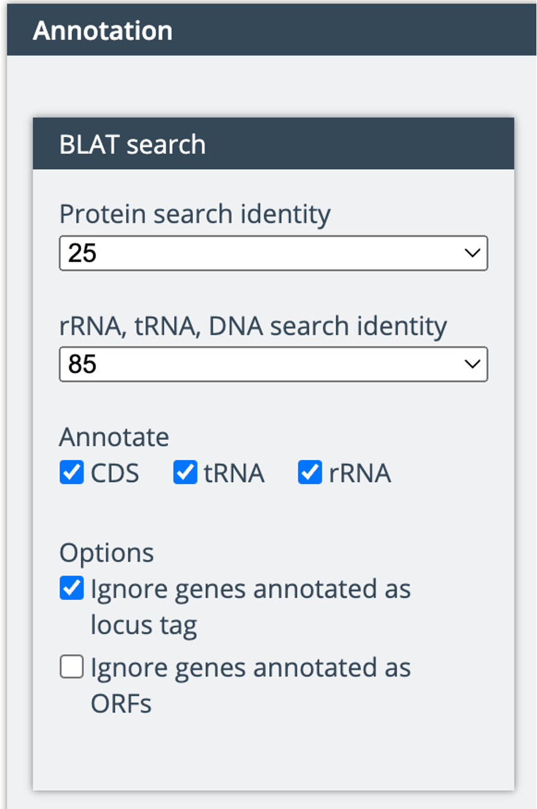
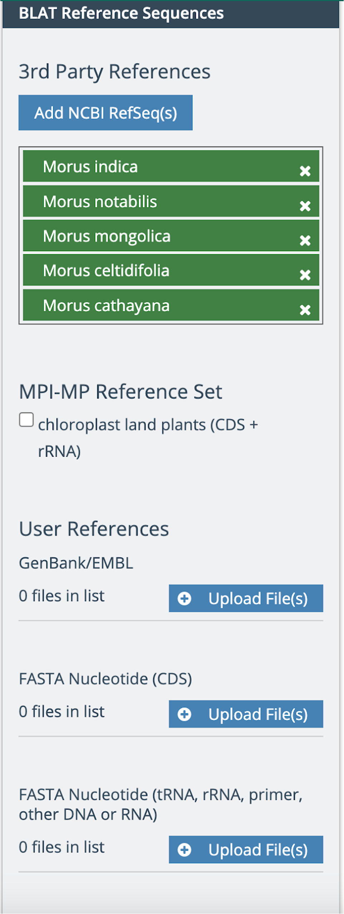
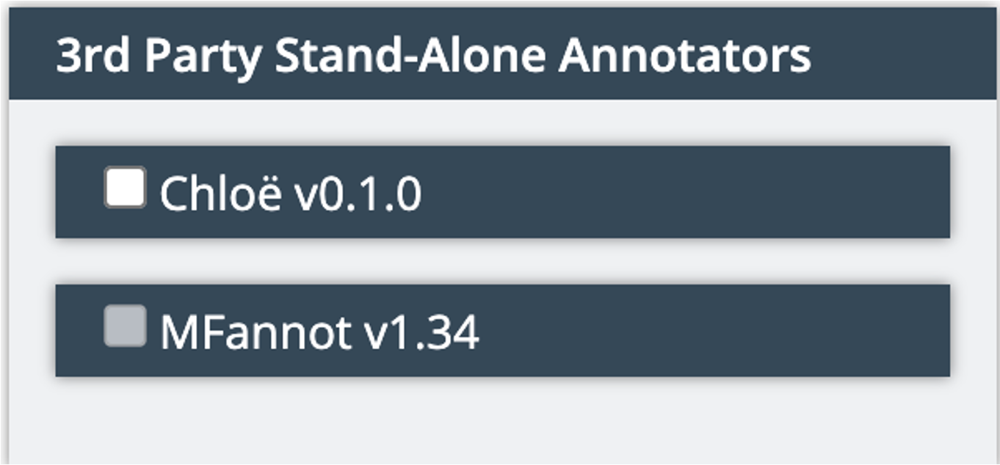
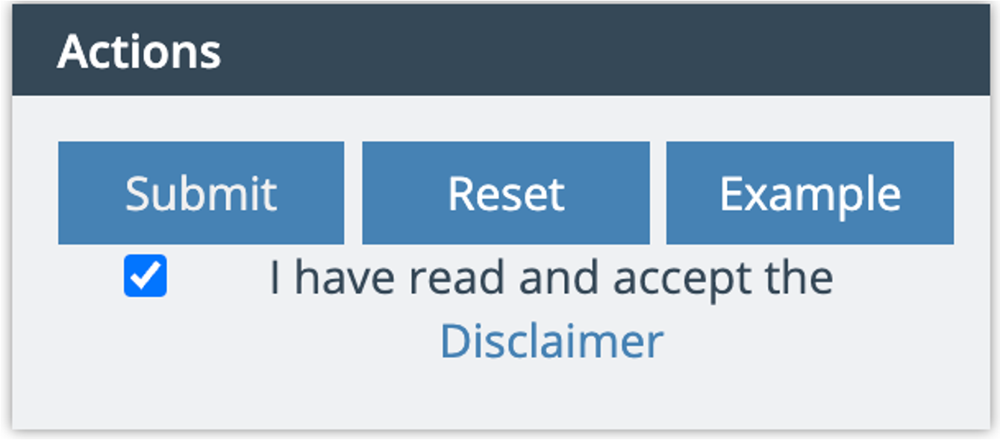
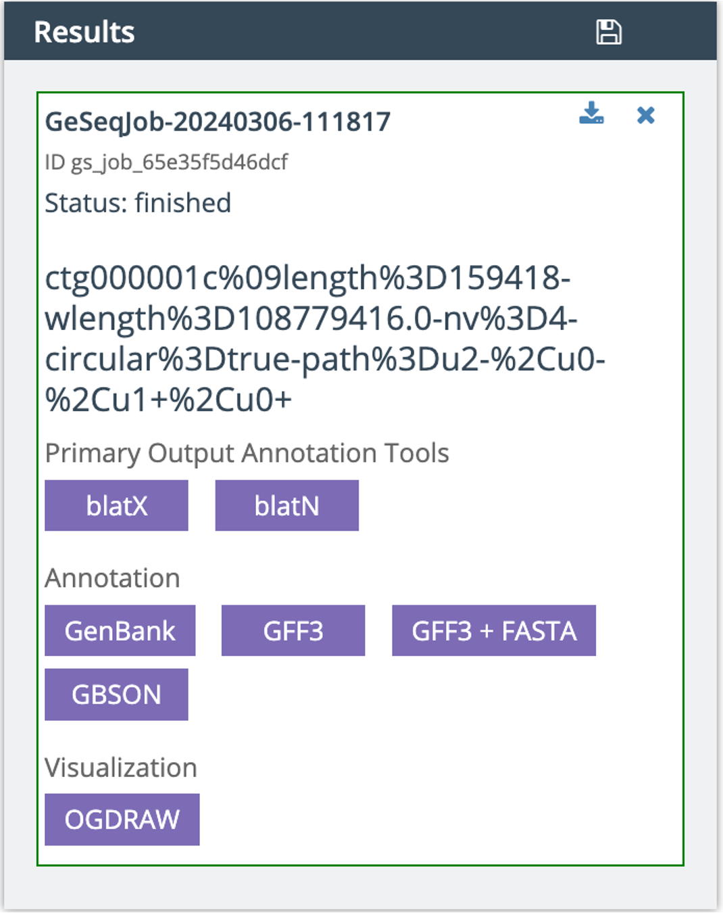

Annotate the Chloroplast
=========================
Use this website to annotate and examine the red mulberry chloroplast genome:
https://chlorobox.mpimp-golm.mpg.de/geseq.html

Fasta file(s) to annotate
^^^^^^^^^^^^^^^^^^^^^^^^

Import your chloroplast fasta

Annotation
^^^^^^^^^^^^^^^^^^^^^^^^
Make sure CDS, tRNA, and rRNA are ticked

BLAT Reference Sequences
^^^^^^^^^^^^^^^^^^^^^^^^
1. Add NCBI RefSeq(s)
2. Search “Morus”
3. Add all 5 species 

3rd Party Stand-Alone Annotators
^^^^^^^^^^^^^^^^^^^^^^^^
Untick Chloe

Actions
^^^^^^^^^^^^^^^^^^^^^^^^
1. Tick “I have read and accept the Disclaimer”
2. Click “Submit”

Results
^^^^^^^^^^^^^^^^^^^^^^^^
1. Hit the save button
2. Download all jobs in one zip.

Back in the terminal
^^^^^^^^^^^^^^^^^^^^
1. Move from Downloads to Genome_Cookbook and double click
2. cd into job-results-*

Questions to address:
""""""""""""""""""""
How big is the red mulberry genome?
How many genes does the red mulberry genome contain?

cat *_GFF3.gff3 | grep -c "gene\t" -

